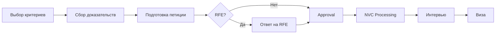
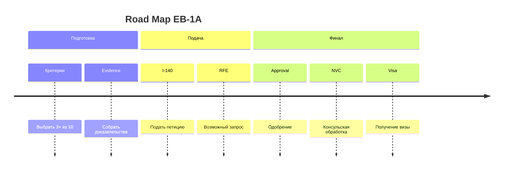
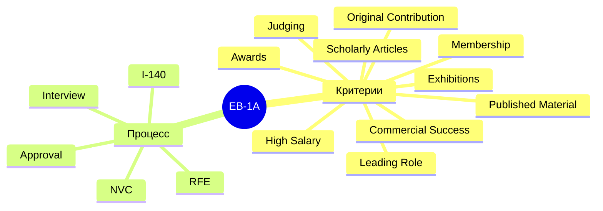

## Вариант 4: Mermaid Diagrams

Встроенная поддержка Mintlify. Диаграммы из кода, без внешних зависимостей.

### Плюсы
- Встроено в Mintlify
- Никаких зависимостей
- Код = диаграмма (легко редактировать)
- Автоматический рендеринг

### Минусы
- Не бесконечная доска
- Ограниченный дизайн
- Сложные диаграммы = сложный код

---

### Демо: Flowchart

### Демо: Timeline

### Демо: Mind Map

<Note>
Mermaid отлично подходит для простых диаграмм процессов. Но это не интерактивная бесконечная доска.
</Note>
