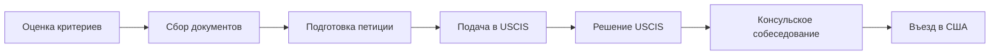

<Note>
**Обновлено:** Декабрь 2026
</Note>

## Как получить визу O-1 в США: пошаговая инструкция

<Info>
**Средние сроки:** 2-4 месяца при обычном рассмотрении, 15 дней при Premium Processing
</Info>

## Обзор процесса получения O-1

Виза O-1 выдается людям с выдающимися способностями в науке, бизнесе, образовании, спорте или искусстве. В отличие от H-1B, здесь нет лотереи и ежегодных квот - подавать можно в любое время года.

Процесс состоит из двух больших этапов: сначала работодатель или агент подает петицию I-129 в USCIS, затем после одобрения вы проходите консульское собеседование и получаете визу в паспорт.

По данным USCIS за 2023 год, одобрено более 95% петиций O-1. Однако это не значит, что виза простая - большинство слабых кейсов отсеиваются еще до подачи. Из нашей базы в 241 RFE видно, что основные причины запросов: недостаточные доказательства по критериям, слабые рекомендательные письма и проблемы с itinerary.

Весь путь от первой консультации до въезда в США занимает 3-9 месяцев в зависимости от сложности кейса и выбора Premium Processing.

## Шаг 1: Оценка критериев (1-2 недели)

Первый и самый важный этап - честно оценить, подходите ли вы под требования O-1. USCIS использует двухступенчатый анализ: сначала проверяют, соответствуете ли вы минимум трем критериям из восьми, затем оценивают кейс в целом на уровень "выдающихся способностей".

Не начинайте собирать документы, пока не убедитесь, что у вас есть материал минимум на 3-4 критерия. Иначе рискуете потратить месяцы работы и тысячи долларов на заведомо слабый кейс.

### Какие критерии проверить

Для O-1A (наука, бизнес, образование, спорт) есть 8 критериев:

1. **Награды** - национальные или международные премии за достижения
2. **Членство** - в организациях, требующих выдающихся достижений для вступления
3. **Публикации о вас** - статьи в профессиональных или крупных СМИ
4. **Судейство** - оценка работ других специалистов в вашей области
5. **Оригинальный вклад** - научные открытия, патенты, внедренные разработки
6. **Авторство** - статьи в профессиональных журналах или значимых изданиях
7. **Ведущая роль** - руководящие позиции в известных организациях
8. **Высокая зарплата** - доход значительно выше среднего по отрасли

Для O-1B (искусство, кино, ТВ) критерии другие - подробнее в разделе [O-1B для творческих](o1-dlya-tvorcheskih).

### Сколько критериев нужно

Формально достаточно трех критериев. На практике большинство одобренных кейсов в нашей базе имеют 4-5 сильных критериев. Если у вас ровно три и они "на грани" - высок риск получить RFE.

Важно понимать: USCIS смотрит не на количество галочек, а на качество доказательств. Один сильный критерий с убедительными документами лучше трех слабых.

### Как провести самооценку

Пройдитесь по каждому критерию и запишите конкретные доказательства. Не "у меня есть награды", а "диплом победителя конкурса X в 2022, сертификат премии Y в 2023". Если не можете назвать конкретный документ - критерий не считается.

Покажите список независимому человеку из вашей индустрии. Спросите: "Это действительно выдающееся достижение или просто хорошая работа?" Честный ответ сэкономит вам время.

<Card title="Калькулятор критериев" icon="calculator" href="https://o1eb1.com">
  Бесплатная оценка ваших критериев
</Card>

## Шаг 2: Поиск петиционера (1-4 недели)

O-1 - это рабочая виза, и подать ее самому на себя нельзя. Нужен американский работодатель или агент, который станет петиционером и подпишет форму I-129.

Это частая точка, где люди застревают. У вас может быть блестящий послужной список, но без петиционера процесс не начнется. Есть три варианта решения: найти работодателя в США, использовать агентскую схему или работать через собственную компанию.

### Кто может быть петиционером

Петиционером может быть:
- **Американская компания** - ваш будущий работодатель с офисом в США
- **Агент** - компания или физлицо, которое представляет ваши интересы
- **Ваша собственная компания** - если вы зарегистрировали LLC или Corp в США

Работодатель берет на себя обязательства: платить вам зарплату, предоставить рабочее место, уведомить USCIS при увольнении. Поэтому не каждая компания готова спонсировать визу.

### Агентская схема: если нет работодателя

Агентская схема подходит фрилансерам, консультантам и тем, кто планирует работать на несколько клиентов. Агент выступает посредником между вами и американскими заказчиками.

Как это работает: агент подает петицию, указывая себя как работодателя. В itinerary перечисляются ваши будущие проекты и клиенты. USCIS видит, что у вас есть конкретный план работы в США на весь срок визы.

Важно: агент должен иметь реальные договоренности с американскими компаниями о ваших услугах. Пустой itinerary без подтвержденных проектов - причина RFE.

### Как найти агента

Агенты работают в разных индустриях: модельные агентства, музыкальные лейблы, продакшн-компании, IT-консалтинги. Поищите компании, которые уже спонсировали визы O-1 в вашей сфере.

Другой вариант - обратиться к иммиграционному юристу. Многие адвокаты имеют партнерские агентства или помогут найти подходящего петиционера. Стоимость услуг агента обычно $2,000-5,000 сверху гонорара юриста.

## Шаг 3: Сбор доказательств (2-8 недель)

Это самый трудоемкий этап. Вам нужно собрать документальные подтверждения для каждого критерия, который вы заявляете. USCIS не принимает голословные утверждения - нужны бумаги.

Типичный пакет доказательств для O-1 составляет 200-500 страниц. Сюда входят: сертификаты наград, скриншоты публикаций с переводами, рекомендательные письма, контракты, справки о зарплате, членские карточки организаций и многое другое.

Начните со сбора того, что у вас уже есть. Затем составьте список недостающих документов: что нужно запросить у работодателей, какие письма попросить у коллег, какие справки заказать.

Главная ошибка на этом этапе - собирать все подряд. Не нужно включать каждый сертификат с онлайн-курса или благодарность от начальника. Фокусируйтесь на доказательствах, которые показывают национальное или международное признание.

Все документы на иностранных языках требуют сертифицированного перевода на английский. Переводчик подписывает декларацию о точности перевода. Это стандартное требование USCIS.

### Документы для каждого критерия

| Критерий | Какие документы нужны |
|----------|----------------------|
| Награды | Дипломы, сертификаты, подтверждение статуса награды |
| Членство | Письмо от организации, устав с требованиями |
| Публикации о вас | Статьи, скриншоты, перевод, тираж издания |
| Судейство | Письма-приглашения, отзывы, скриншоты |
| Оригинальный вклад | Рекомендательные письма, патенты, внедрения |
| Авторство статей | Публикации, цитирования, импакт-фактор |
| Ведущая роль | Должностная инструкция, оргструктура |
| Высокая зарплата | Контракты, справки, налоговые декларации |

### Рекомендательные письма

Рекомендательные письма - один из ключевых элементов петиции. Они нужны для критерия "оригинальный вклад", но усиливают и другие разделы кейса.

Хорошее письмо пишет эксперт, который знает вашу работу и может объяснить ее значимость. Идеально - известный специалист в вашей области, который не является вашим непосредственным начальником или родственником. USCIS ценит независимые мнения.

Структура письма: кто автор и почему его мнение авторитетно, как он знаком с вашей работой, в чем ваш конкретный вклад в отрасль, почему это важно. Избегайте общих фраз вроде "отличный специалист" - нужна конкретика.

Сколько писем нужно: обычно 5-8 для сильного кейса. Лучше меньше качественных, чем много слабых.

### Экспертное заключение (Advisory Opinion)

Advisory Opinion - это письмо от профессиональной организации или профсоюза, подтверждающее вашу квалификацию. Для O-1 это обязательный документ.

Если в вашей индустрии есть профсоюз (SAG-AFTRA для актеров, AFM для музыкантов), обращаетесь туда. Они выдают консультационные письма за фиксированную плату.

Если профсоюза нет (IT, бизнес, наука) - USCIS принимает письмо от авторитетного эксперта или организации в вашей области. В письме указывают, почему автор компетентен давать оценку и какое мнение о вашей квалификации.

## Шаг 4: Подготовка петиции I-129 (2-4 недели)

Петиция I-129 - это официальное заявление работодателя в USCIS с просьбой разрешить вам работать в США. К форме прилагается O/P Supplement и весь пакет доказательств.

На этом этапе все ваши достижения и документы собираются в единый аргументированный кейс. Важно не просто приложить бумаги, а выстроить логическую цепочку: вот критерии, вот доказательства по каждому, вот почему заявитель соответствует стандарту выдающихся способностей.

Большинство заявителей работают с иммиграционным юристом на этом этапе. Юрист знает, как структурировать петицию, какие формулировки использовать, на что обращает внимание USCIS. Самостоятельная подача возможна, но требует серьезной подготовки.

### Структура петиции

Типичный пакет включает:
- **Form I-129** с O/P Supplement - основная форма заявления
- **Support Letter** - письмо от работодателя (10-30 страниц)
- **Advisory Opinion** - консультационное письмо
- **Itinerary** - план работы в США
- **Evidence Package** - доказательства по критериям с разделителями
- **Cover Letter и Table of Contents** - навигация по пакету

Все документы нумеруются и организуются по вкладкам. Офицер USCIS должен легко найти любое доказательство по ссылке из Support Letter.

### Support Letter: как написать

Support Letter - это главный документ петиции. В нем работодатель объясняет, почему вы соответствуете требованиям O-1 и зачем нужны компании.

Структура: описание компании-петиционера, ваши будущие обязанности, разбор каждого критерия с указанием конкретных доказательств (Exhibit A, B, C...), вывод о соответствии стандарту выдающихся способностей.

Объем: 10-30 страниц в зависимости от сложности кейса. Письмо подписывает уполномоченный представитель работодателя.

### Типичные ошибки

По данным нашей базы RFE, чаще всего проблемы возникают из-за:
- **Слабых доказательств** - документы не подтверждают заявленный критерий
- **Отсутствия контекста** - непонятно, почему награда или членство значимы
- **Проблем с itinerary** - неясно, чем заявитель будет заниматься в США
- **Формальных ошибок** - неправильно заполненные формы, отсутствие подписей, просроченные документы

Проверяйте пакет несколько раз перед отправкой. Ошибка в форме может привести к возврату всего заявления.

## Шаг 5: Подача в USCIS (1 день)

После сборки пакета его отправляют в сервисный центр USCIS. Подача занимает один день, но подготовка к ней требует внимания к деталям: правильный адрес, корректная сумма оплаты, все необходимые подписи.

Петицию отправляют курьерской службой с трекингом (FedEx, UPS, DHL). Обычная почта USPS тоже принимается, но курьер надежнее и дает подтверждение доставки. Сохраните номер отслеживания - он понадобится для проверки статуса.

После получения пакета USCIS выдает receipt number. Это ваш уникальный номер кейса, по которому можно отслеживать статус на сайте USCIS. Получение receipt занимает 1-3 недели.

### Куда подавать

Адрес зависит от типа петиции и выбора Premium Processing:

- **California Service Center** - для петиций из западных штатов и некоторых категорий O-1B
- **Vermont Service Center** - для петиций из восточных штатов
- **Texas или Nebraska** - для Premium Processing (отдельные адреса)

Точный адрес смотрите на сайте USCIS в разделе Direct Filing Addresses для формы I-129. Адреса периодически меняются, поэтому проверяйте актуальную информацию перед отправкой.

### Обычное рассмотрение vs Premium Processing

Premium Processing ($2,805 сверху filing fee) гарантирует решение за 15 календарных дней. Это не гарантия одобрения - могут одобрить, отказать или выдать RFE за те же 15 дней.

Без Premium рассмотрение занимает 2-4 месяца, иногда дольше. Сроки зависят от загрузки сервисного центра и сложности кейса. Текущие сроки публикуются на сайте USCIS.

| Тип | Срок | Стоимость |
|-----|------|-----------|
| Обычное | 2-4 месяца | $460 |
| Premium | 15 дней | $460 + $2,805 |

## Шаг 6: Ответ на RFE (если придет)

RFE (Request for Evidence) - это запрос дополнительных доказательств от USCIS. Получение RFE не означает отказ, это возможность усилить кейс. По нашим данным, большинство петиций после качественного ответа на RFE одобряются.

На ответ дается 87 дней с даты отправки RFE (не получения). Срок жесткий - пропуск означает автоматический отказ. Планируйте ответ заранее и отправляйте с запасом времени.

RFE приходит примерно в 20-30% первичных петиций O-1. Это нормальная часть процесса, не повод для паники. Главное - понять, что именно просит офицер, и дать исчерпывающий ответ.

### Что такое RFE

RFE - это официальное письмо от USCIS с перечнем вопросов или запросов на дополнительные документы. Офицер указывает, какие критерии или аргументы показались ему недостаточно обоснованными.

Типичные причины RFE:
- Недостаточно доказательств по конкретному критерию
- Непонятно, почему награда или организация считается престижной
- Нужны дополнительные рекомендательные письма
- Вопросы к itinerary или условиям работы

### Как отвечать на RFE

Ответ на RFE - это возможность усилить изначальную петицию. Не просто отвечайте на вопросы, а добавляйте новые доказательства.

Структура ответа: обращение к каждому пункту RFE по порядку, новые документы с объяснениями, обновленное резюме аргументации. Ответ может быть объемнее изначальной петиции.

Изучите конкретные формулировки RFE. Если офицер пишет "недостаточно доказательств значимости награды" - приложите статистику участников, историю премии, отзывы в прессе. Отвечайте точно на то, что спрашивают.

<Card title="База RFE: 241 случай" icon="database" href="rfe-data/all">
  Изучите реальные RFE и успешные ответы
</Card>

## Шаг 7: Консульское собеседование (1 день)

После одобрения петиции USCIS отправляет данные в National Visa Center (NVC), а оттуда в выбранное вами консульство. Вы заполняете форму DS-160, оплачиваете консульский сбор MRV ($315) и записываетесь на собеседование.

Само собеседование занимает 5-15 минут. Офицер проверяет документы, задает несколько вопросов о вашей работе и планах в США, и принимает решение. В большинстве случаев визу одобряют на месте.

Возьмите с собой: паспорт, подтверждение DS-160, квитанцию MRV, оригинал I-797 (approval notice), полную копию петиции, актуальный контракт и itinerary. Если документы на иностранном языке - переводы тоже.

Для граждан России консульства США в РФ не работают с 2022 года. Собеседование проходят в третьих странах: Польша, Казахстан, Сербия, Израиль, Армения и других.

### Где проходить собеседование россиянам

Выбор консульства зависит от сроков записи, требований к въезду в страну и личных предпочтений. Вот основные варианты:

| Консульство | Сроки записи | Особенности |
|-------------|--------------|-------------|
| Варшава | 1-2 месяца | Популярное |
| Астана | 2-4 недели | Быстрее запись |
| Тель-Авив | 1-3 месяца | Требуется виза |
| Белград | 2-4 недели | Без визы |

### Что спрашивают на собеседовании

Типичные вопросы офицера:
- Чем вы занимаетесь? Расскажите о своей работе
- Кто ваш работодатель в США? Чем занимается компания?
- Какие у вас будут обязанности?
- Почему вы считаете себя специалистом выдающегося уровня?
- Какие у вас награды или достижения?

Отвечайте кратко и по существу. Офицер уже видел вашу петицию - ему нужно убедиться, что вы реальный человек с реальными планами. Не нужно пересказывать все достижения, достаточно нескольких ключевых примеров.

### Административная проверка (221g)

Административная проверка (Administrative Processing, форма 221g) - это дополнительная проверка безопасности. Ее назначают заявителям из определенных стран или работающим в чувствительных областях: ядерная физика, биотехнологии, криптография, аэрокосмическая отрасль.

Для граждан России и специалистов в STEM проверка назначается часто. Срок: от 2 недель до 12 месяцев, в среднем 2-4 месяца. Ускорить процесс практически невозможно.

Если получили 221g - сдайте паспорт по инструкции и ждите. Отслеживать статус можно на сайте CEAC. Подробнее в разделе [Административная проверка](administrative-check/faq).

## Шаг 8: Въезд в США

После получения визы в паспорте вы можете въехать в США. Виза - это разрешение на въезд, а не гарантия. Финальное решение принимает офицер CBP (Customs and Border Protection) на границе.

При первом въезде по O-1 выделите больше времени на прохождение контроля. Офицер может задать дополнительные вопросы о цели визита и работодателе. Это стандартная процедура.

После въезда вы получаете штамп в паспорте и форму I-94 (электронную). I-94 показывает разрешенный срок пребывания - он может отличаться от срока действия визы. Проверьте дату на I-94 на сайте CBP.

### Что показывать на границе

На контроле вам понадобятся:
- Паспорт с визой O-1
- Копия I-797 (approval notice)
- Контракт или письмо от работодателя
- Itinerary с планом работы

Офицер может спросить: куда едете, кто работодатель, чем будете заниматься, где будете жить. Отвечайте честно и кратко. Если все документы в порядке, процесс занимает несколько минут.

## Полный таймлайн: от старта до въезда

| Этап | Срок | Накопительно |
|------|------|--------------|
| Оценка критериев | 1-2 недели | 2 недели |
| Поиск петиционера | 1-4 недели | 6 недель |
| Сбор документов | 2-8 недель | 14 недель |
| Подготовка петиции | 2-4 недели | 18 недель |
| Рассмотрение USCIS | 2-16 недель | 34 недели |
| Консульство | 1-4 недели | 38 недель |
| **Итого** | **3-9 месяцев** | |

## FAQ

<AccordionGroup>
  <Accordion title="Можно ли ускорить процесс?">
    Да, через Premium Processing ($2,805) рассмотрение занимает 15 дней вместо 2-4 месяцев.
  </Accordion>

  <Accordion title="Что делать при отказе?">
    При RFE - ответить в течение 87 дней. При Denial - можно подать апелляцию или новую петицию.
  </Accordion>

  <Accordion title="Нужен ли юрист?">
    Не обязательно. ~28% кейсов в нашей базе поданы самостоятельно.
  </Accordion>

  <Accordion title="Можно ли подать самостоятельно?">
    Да, если у вас сильный кейс и вы готовы потратить время на изучение требований.
  </Accordion>

  <Accordion title="Что если поменялся работодатель?">
    Нужно подать amendment петицию с новым работодателем или использовать агентскую схему.
  </Accordion>
</AccordionGroup>

## Следующие шаги

<CardGroup cols={3}>
  <Card title="Чеклист документов O-1" icon="clipboard-check" href="after-approval/o1-documents">
    Полный список для USCIS и консульства
  </Card>
  <Card title="Истории успеха" icon="trophy" href="success-stories/index">
    108 реальных одобрений
  </Card>
  <Card title="Помощь эксперта" icon="user-tie" href="https://www.o1eb1.com/help/egor">
    Консультация с автором базы
  </Card>
</CardGroup>

---

